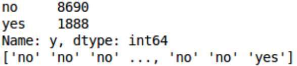

# 机器学习之随机森林实战——Classification
Two-Classes Prediction of bank customer's time deposit intention

[利用提供的银行客户信息对客户是否会定期存款进行二分类预测](https://www.kaggle.com/c/tonhjiprmidterm)

## 文件说明
* MT_train.csv：训练集数据  
* MT_test.csv：为测试集数据  
* MTSampleSubmission.csv：提交结果格式样例文件  
* FinalResult.csv：结果文件  
* MidTerm.ipynb：主程序
* DataDescription.txt：数据集详细说明

## 数据集说明
* 训练集样本数量：10578个，测试集样本数量：15929个  
* 样本基本属性数量：20个，具体见[**数据集详细说明**](DataDescription.txt)  
* 结果文件格式如下表，具体可参考[**结果格式**](MTSampleSubmission.csv)  
 
SampleId | y
:-: | :-:
0 | yes
1 | no
2 | yes
3 | no

## 方法步骤
* 数据预处理  
* 训练随机森林二分类模型  
* 模型测试，调参优化
* 输出结果

## 结果
对测试预测输出结果：  
  

指标 | 精度 | 综合得分
:-: | :-: | :-:
数值 | 0.894 | 0.901

## License
MIT
